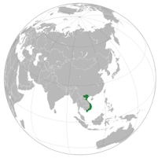

# About Pyhash Market Making

Founded in 2018, Pyhash is a digital asset management institution providing after market support and treasury management solutions to token issuers, institutions, investors, and mining operations in the blockchain ecosystem. 

Pyhash team is comprised of over 10 professionals based in Vietnam with proven technical capability and extensive trading experiences. 

The firm has serviced over 20 clients across a variety of geographical jurisdictions and trades upwards of US$50M worth of assets per month.

**Pyhash leverages best-in-class trade execution, infrastructure, and market insights to provide lifetime value-add to clients across a broad spectrum of needs.**

