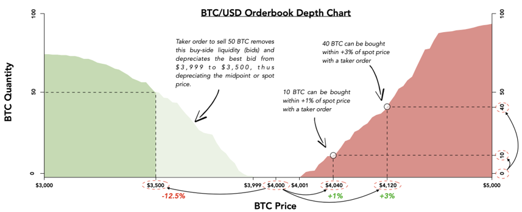

# How are liquidity and price inextricably tied?

Because trades are consummated as takers remove liquidity, the consequence of a trade can be a movement in price. This occurs because taker orders satisfy the willingness of buyers to buy, or sellers to sell \(“order fills”\). Orderbooks and liquidity can be interpreted in many ways just by understanding the dynamic between makers and takers — see the below illustration for examples:

