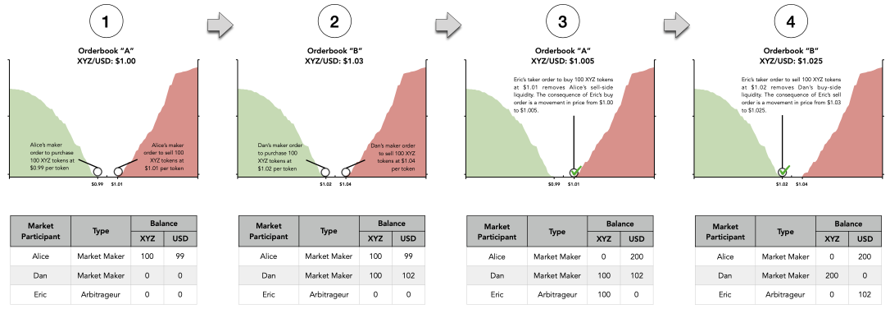

# How are liquidity and trade volume inextricably tied?

A large portion of exchange trade volume results from an interplay between market makers and arbitrageurs. An arbitrageur is a marketplace participant that places a taker order to purchase a crypto asset on one orderbook and then places a taker order to sell the asset on a different orderbook at a higher price, thus generating risk-free profit. Arbitrageurs take advantage of pricing discrepancies across various orderbooks that list a particular crypto asset. In order to engage in this sort of trade activity, there must be willing sellers on the orderbook which the arbitrageur buys from, and willing buyers on the orderbook which the arbitrageur sells to. This willingness to buy or sell \(liquidity\) is generally provided by market makers that exist on each orderbook.

