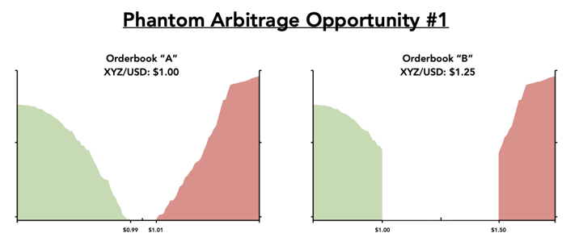
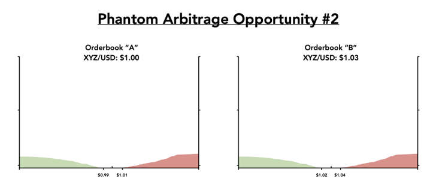

# Phantom arbitrage opportunities

“Phantom” arbitrage opportunities exist when a significant price discrepancy exists between two disparate orderbooks; however, a lack of liquidity on one — or both —- orderbook\(s\) eliminates potential for an arbitrageur to buy low on one orderbook and sell high on the other. In order for a price discrepancy between desperate orderbooks to reflect an attractive arbitrage opportunity, each orderbook must be able to facilitate fair execution prices wherein the midpoint \(“spot price”\) closely reflects the average price of an order fill for both buy and sell orders. This means that each orderbook should have \(1\) tight spreads, and \(2\) deep liquidity tight to midpoint.

Unattractive arbitrage opportunity due to wide spreads. The spot price on Orderbook B of $1.25 is not an accurate reflection of the price a seller will receive for XYZ after buying on Orderbook A.

Unattractive arbitrage opportunity due to a lack of deep liquidity. The spot price on Orderbook B of $1.03 is not an accurate reflection of the price a seller will receive when attempting to sell any sizable quantity of XYZ after buying on Orderbook A. Similarly, a lack of sell- side liquidity on Orderbook A prevents an arbitrageur from purchasing any sizable quantity of XYZ without moving the market.

