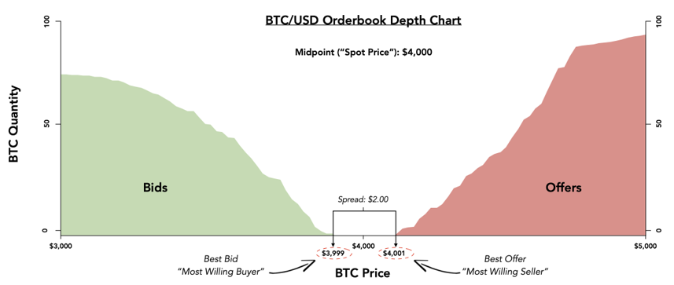

# What are spread?

A spread is the difference between the price the most willing buyer will accept to transact \(“best bid”\), and the price the most willing seller will accept to transact \(“best offer”\). The midpoint between the best bid and best offer is the price of the token \(“spot price”\).

