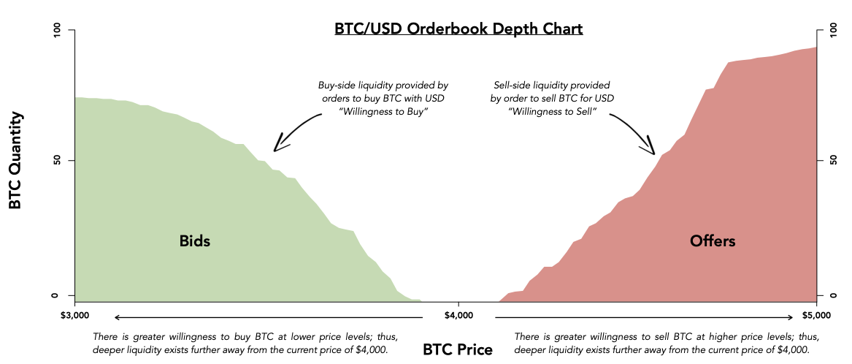

# What does liquidity look like?

Liquidity \(also referred to as market depth\) is the willingness of buyers to purchase an asset at a discount to the prevailing market rate \(“bids”\), and the willingness of sellers to sell an asset at a premium to the prevailing market rate \(“offers”\). An orderbook depth chart is the most common visualization of liquidity — it represents cumulative demand to both buy and sell a particular asset.

