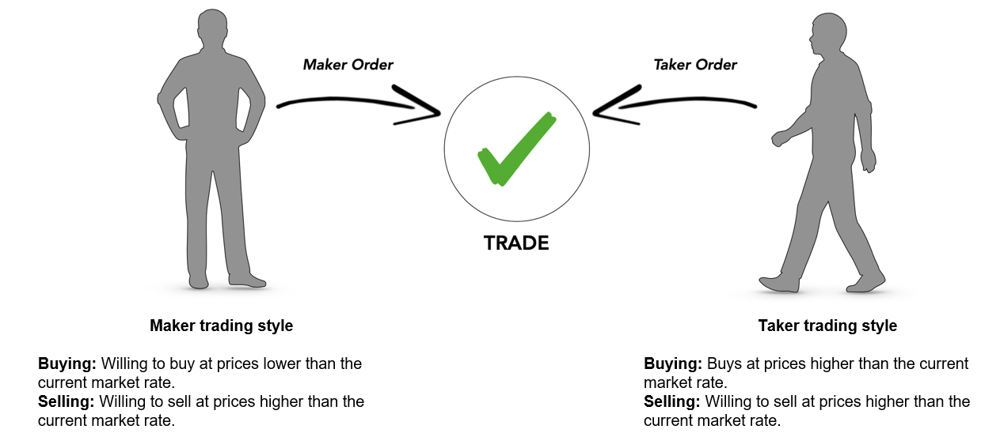

# What is a trade comprised of?

Each trade on an exchange’s orderbook involves two orders: an order that provides liquidity \(“maker orders”\) and an order that removes liquidity, called a taker order. Whereas makers are patient buyers and sellers, takers are aggressive and execute in the moment. When a maker and taker order interact with one another, a trade is consummated.

