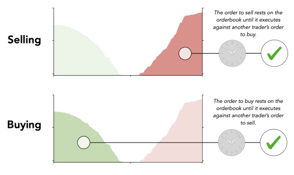

# Where does liquidity come from?

Liquidity comes from patient buyers or sellers that place orders to “make liquidity”; because of this, these market participants are referred to as makers. Makers are generally savvy and strategic. Instead of trading immediately, their orders will wait \(i.e., rest on an orderbook\) until another market participants choose to trade against them.

