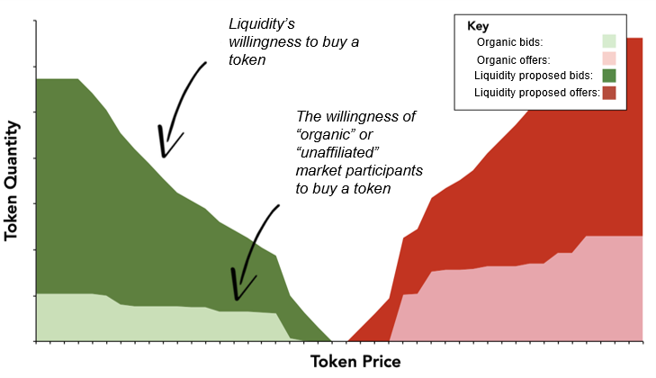
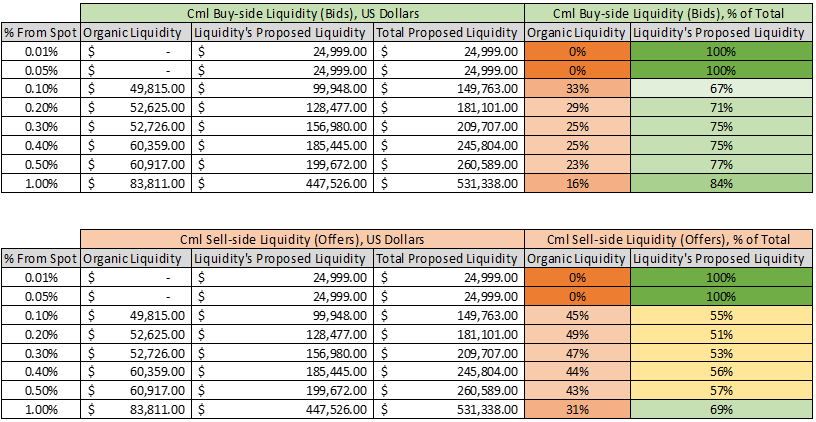
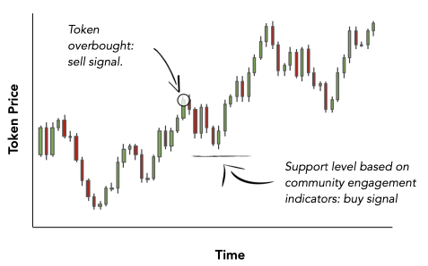
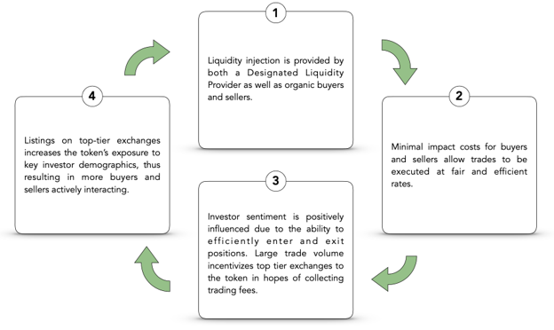

# Impact of post-listing support

## Deep liquidity

Liquidity provides deep two-way liquidity \(bids & offers\) and tight spreads to encourage trade activity and ensure buyers and sellers can trade at efficient prices. Sophisticated algorithms exercise dynamic price stabilization to counteract dramatic price swings.

**Key Facts:** Aftermarket Support Program 

1. creates conditions for organic trade volume,
2. mitigates volatility & promote efficient price discovery,
3. deters runaway price capitulation,
4. attracts liquidity from unaffiliated marketplace participants.

## AUM growth

Liquidity engages in a variety of discretionary and algorithmic trading strategies to grow AUM on behalf of clientele. This includes sentiment-based analysis to purchase and sell mis-priced tokens, high-speed latency arbitrage, and dynamic portfolio hedging.

**Key Facts:** Aftermarket Support Program provides 

1. 24/7 coverage from dedicated portfolio managers,
2. leverages institution and investor connections to trade over-the-counter off exchange on behalf of the client, 
3. and hedges portfolio into diversified assets and stable coins. 

## Positive feedback

With a Designated Liquidity Provider serving as a catalyst, a new token marketplace may enter into a self-enforcing cycle of “liquidity begets liquidity” as seen below:

