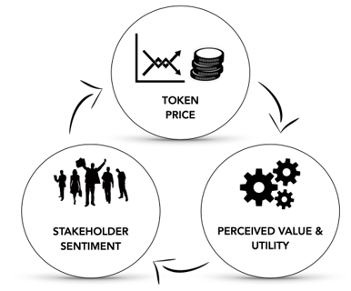
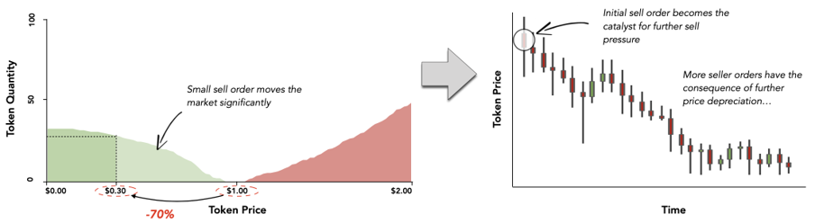
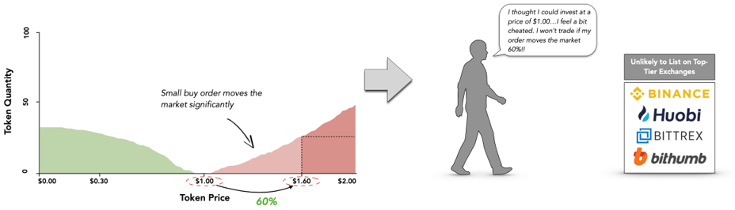
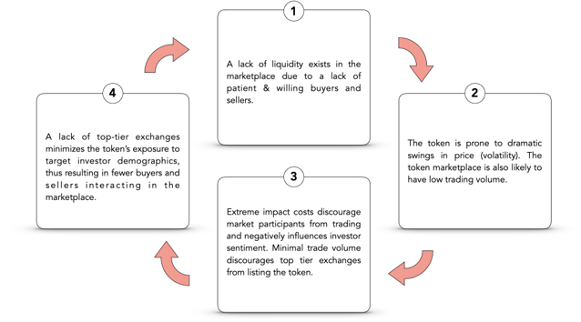

# Why post-listing support?

## Valuation

Blockchain projects lack metrics used in traditional asset markets \(such as price-to-earnings \(“P/E”\) ratio\) to determine valuation and associated share price. Because of this, token communities must rely on token price as an indication of underlying utility and intrinsic value; therefore, a virtuous cycle exists between token price, perceived value & utility, and stakeholder sentiment.

## Liquidity

In mature markets, liquidity allows buyers and sellers to trade without significant influence on price; however, most token marketplaces lack sufficient liquidity to facilitate fair price discovery. Dramatic swings in token price often come as the result of natural buying and selling pressures in an illiquid token marketplace, rather than a change in a token’s fundamentals or use case. This volatility can result in panic selling or runaway price appreciation \(“price capitulation”\).

**Key Theme:** Shifts in token price are often uncorrelated with evolving or deteriorating fundamentals. Price action does however impact investor sentiment — investors may respond buy building larger positions, or exiting positions.

## Trading volume

Illiquid marketplaces are prone to low trading volumes — buyers and sellers cannot trade at efficient prices; therefore, they are unlikely to interact. With no promise of revenues from trading fees, exchanges are unlikely to list tokens with low trading volume. Top-tier exchanges often de-list tokens with poor liquidity due to the poor user experience they provide to both buyers and sellers seeking to trade the token.

**Key Theme:** Takers may be aggressive, but they are not irrational; therefore, they are unlikely to trade assets that offer poor execution prices. Illiquid assets provide little benefit to exchanges seeking to maximize revenues via trading fees and may also damage brand.

## Negative feedback prevention

Immature token marketplaces, such as the marketplace of a newly issued token, lack organic liquidity. An absence of liquidity often leads to a negative feedback loop of “less liquidity begets less liquidity” as seen below:

